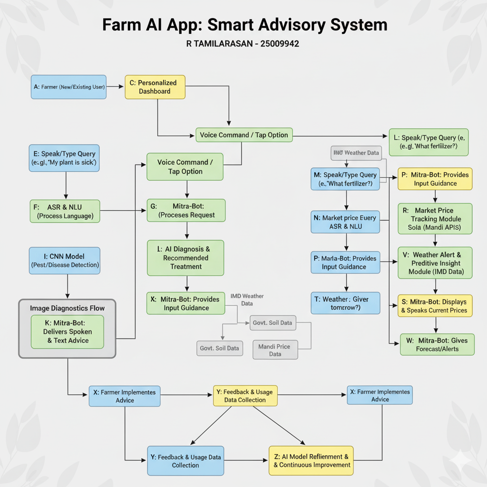

# Smart India Hackathon Workshop
# Date:29/-9/2025
## Register Number:25009942
## Name:R TAMILARASAN
## Problem Title 
SIH 25010: Smart Crop Advisory System for Small and Marginal Farmers
## Problem Description
A majority of small and marginal farmers in India rely on traditional knowledge, local shopkeepers, or guesswork for crop selection, pest control, and fertilizer use. They lack access to personalized, real-time advisory services that account for soil type, weather conditions, and crop history. This often leads to poor yield, excessive input costs, and environmental degradation due to overuse of chemicals. Language barriers, low digital literacy, and absence of localized tools further limit their access to modern agri-tech resources.

Impact / Why this problem needs to be solved

Helping small farmers make informed decisions can significantly increase productivity, reduce costs, and improve livelihoods. It also contributes to sustainable farming practices, food security, and environmental conservation. A smart advisory solution can empower farmers with scientific insights in their native language and reduce dependency on unreliable third-party advice.

Expected Outcomes

• A multilingual, AI-based mobile app or chatbot that provides real-time, location-specific crop advisory.
• Soil health recommendations and fertilizer guidance.
• Weather-based alerts and predictive insights.
• Pest/disease detection via image uploads.
• Market price tracking.
• Voice support for low-literate users.
• Feedback and usage data collection for continuous improvement.

Relevant Stakeholders / Beneficiaries

• Small and marginal farmers
• Agricultural extension officers
• Government agriculture departments
• NGOs and cooperatives
• Agri-tech startups

Supporting Data

• 86% of Indian farmers are small or marginal (NABARD Report, 2022).
• Studies show ICT-based advisories can increase crop yield by 20–30%.

## Problem Creater's Organization
Government of Punjab

## Theme
Agriculture, FoodTech & Rural Development

## Proposed Solution
The solution is "Farm AI" (The Farmer's Friend), an AI-powered, multilingual mobile app that solves low literacy and guesswork by providing personalized, real-time advice. Its key innovation is the voice-first interface and a Visual Diagnostics Module (CNN) for image-based pest detection. The app uses an Input Optimization Engine that integrates hyper-local weather and soil data to recommend the precise, minimal dosage for fertilizer and water, directly reducing costs, chemical overuse, and the farmer's reliance on unreliable local advice.

## Technical Approach
The Technical Approach uses a scalable architecture built on Python for backend logic and SQL for data persistence. The modern, interactive frontend is developed using the ReactJS framework with JavaScript, HTML, and CSS, ensuring cross-platform accessibility via web browsers. Data is integrated from reliable sources including IMD (weather) and government APIs for crop health. Implementation is phased: core voice and diagnostics MVP first, followed by pilot testing for continuous model re-training, and final expansion to include market prices and full language support.

## Feasibility and Viability
The project is highly Feasible due to readily available open-source technology and public data APIs. The primary challenge is overcoming the high risk of farmer adoption, which will be addressed through localized training via KVKs and the app's intuitive voice design. Viability is assured via a public service contract with the Government of Punjab, supplemented by a B2B revenue stream from selling anonymized agricultural data to input suppliers.

## Impact and Benefits
The resulting Impact will be profound, directly benefiting the 86% of Indian farmers who are small or marginal. Economically, the solution is projected to increase crop yield by 20–30% and reduce input costs by 10-15%. Socially, the voice support ensures equitable access to modern agricultural science. Environmentally, precision recommendations lead to reduced soil and water pollution, promoting sustainable farming practices.

## Diagram

## Research and References
https://www.tandfonline.com/doi/full/10.1080/02681102.2025.2456232#abstract

Supporting data includes the NABARD Report (2022) (for the 86% statistic) and various Academic Studies on ICT in Agriculture, which validate the projected 20–30% yield increase. The technical and scientific foundation rests on data from ICAR and the IMD Data Portal, confirming the solution's robust and researched basis.
